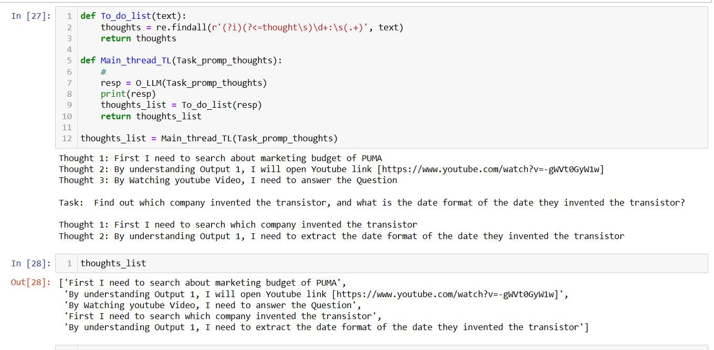
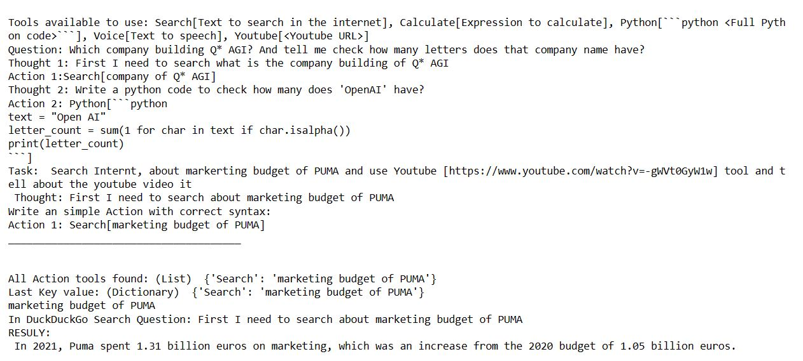
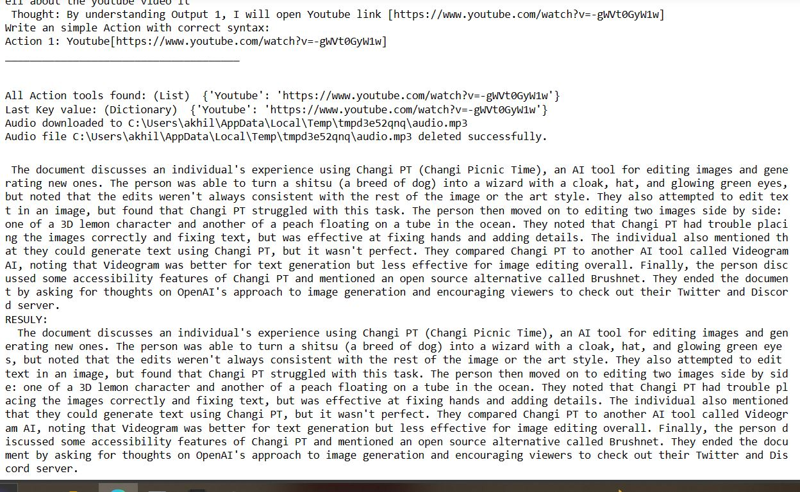
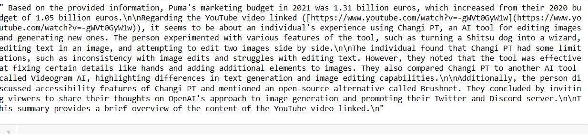

# ReACT Research Paper-inspired Prompt

This project is a Python implementation of a ReACT research paper-inspired prompt.

## Task Breakdown

Here's a breakdown of all the tasks involved, which collectively form a complex task.

### Task 1: Internet Search and Summarization

The model initiates an internet search via a 'Search' action, processes the returned text, and generates a summary.

### Task 2: YouTube Video Summarization

Upon completing Task 1, the system proceeds to Task 2. Here, a YouTube link is provided for summarization. The system invokes the YouTube function, downloads audio, converts it to text, and saves it in a designated folder. Since the text file is too large for direct processing, a vector database using llama index is created, and a summary is generated.

Upon completion of all tasks, the model consolidates all generated answers to provide a final summary.

## AI Agent Overview

This serves as a foundational AI agent, though it possesses certain limitations, notably its reliance on a large context window and powerful models.

For the current low- and high-end models in development, the architecture outlined below may prove optimal.

