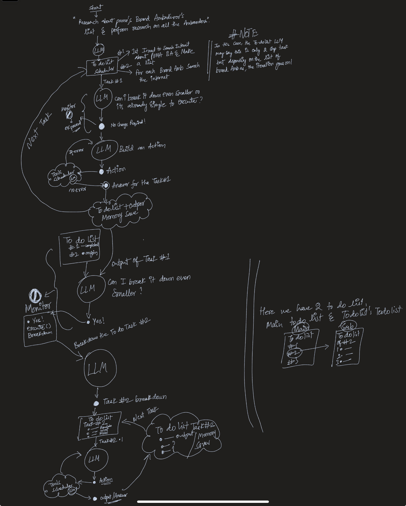

This is a ReACT research paper-inspired prompt. It's all scratch built in Python. 

This is the basic working AI agent, but there are obvious disadvantages, including that it requires a large context window and powerful models.

The architecture I described below might be best for the low- and high-end models I am trying to build now.

